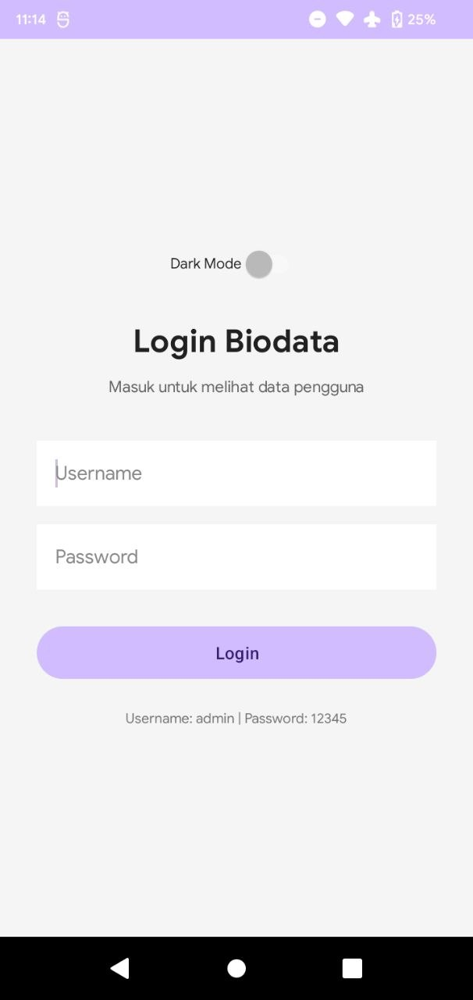
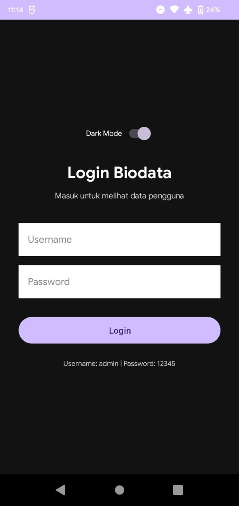
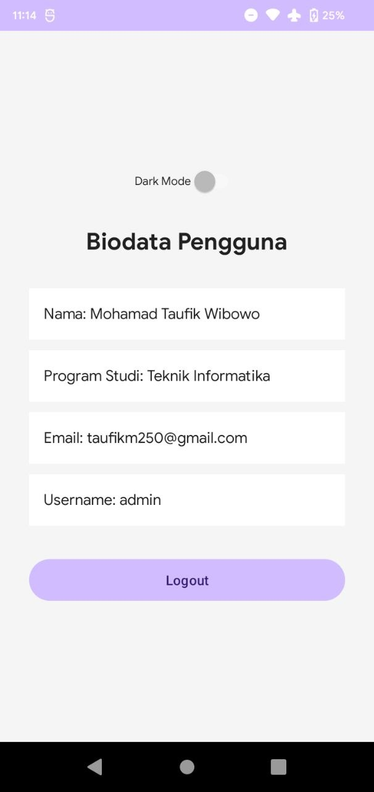
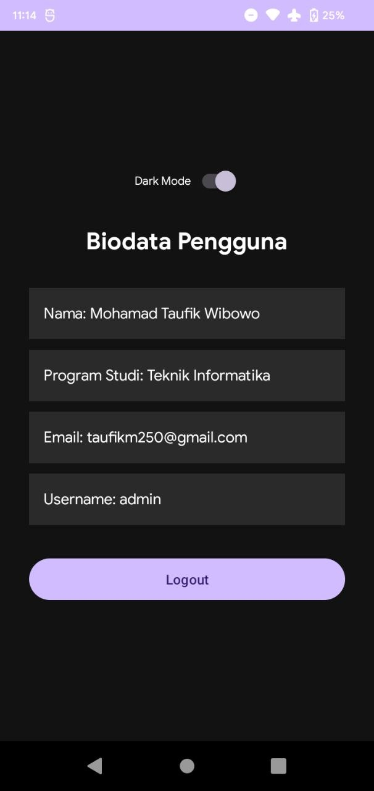

# SharedPreferencesKotlin

A simple Android application demonstrating the use of SharedPreferences in Kotlin for managing session login and theme preferences.

## Features
- **Login Session:** Save login state and user data using SharedPreferences.
- **Dark Mode Toggle:** Persistent theme selection that stays even after the app is closed.
- **Auto Login:** Automatically redirects to the Biodata screen if the user is already logged in.
- **Logout:** Clears session data and returns to the Login screen.

## Screenshots

### Login Screen
| Light Mode | Dark Mode |
|------------|-----------|
|  |  |

### Biodata Screen
| Light Mode | Dark Mode |
|------------|-----------|
|  |  |

## How to use
1. Clone the repository.
2. Open in Android Studio.
3. Build and run on an emulator or physical device.
